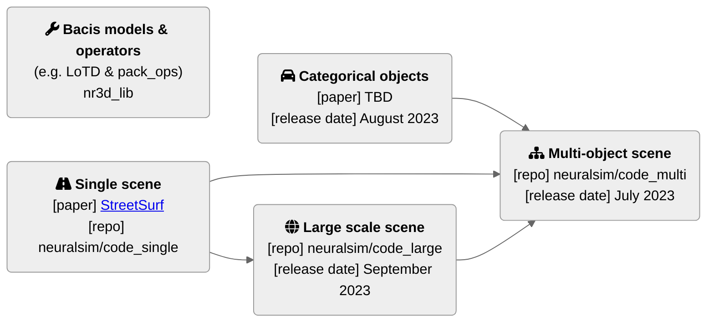

# neuralsim
3D reconstruction and simulation based on 3D neural rendering.

```mermaid
%%{init: {'theme': 'neutral', "flowchart" : { "curve" : "basis" } } }%%
graph LR;
    0("fa:fa-wrench <b>Bacis models & operators</b><br/>(e.g. LoTD & pack_ops)<br/>nr3d_lib")
    A("fa:fa-road <b>Single scene</b><br/>[paper] <a href='https://ventusff.github.io/streetsurf_web/' target='_blank'>StreetSurf</a><br/>[repo] neuralsim/code_single")
    B("fa:fa-car <b>Categorical objects</b><br/>[paper] TBD<br/>[release date] August 2023")
    C("fa:fa-globe <b>Large scale scene</b><br/>[repo] neuralsim/code_large<br/>[release date] September 2023")
    D("fa:fa-sitemap <b>Multi-object scene</b><br/>[repo] neuralsim/code_multi<br/>[release date] July 2023")
    B --> D
    A --> D
    A --> C
    C --> D
```
