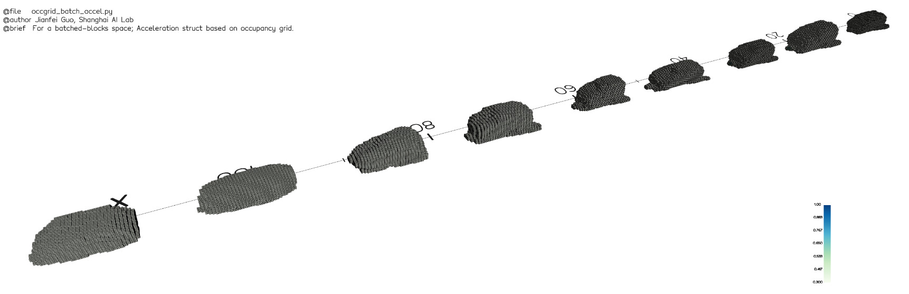
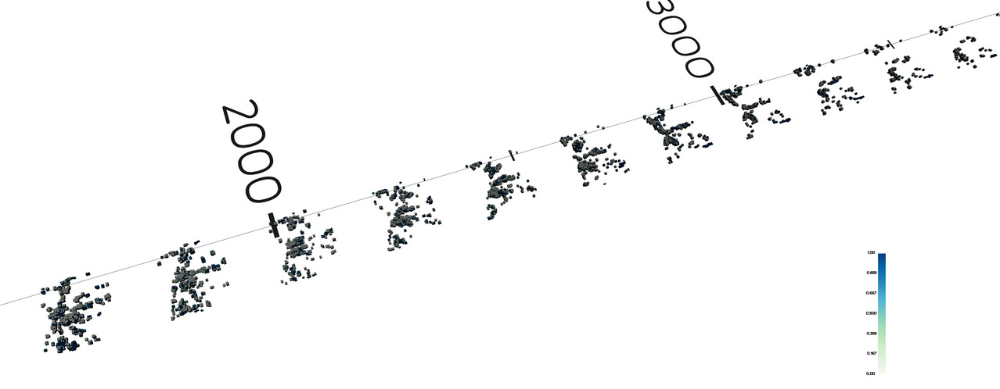
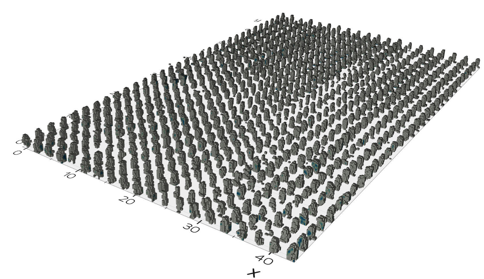

#  neuralsim

3D surface reconstruction and simulation based on 3D neural rendering.

This repository primarily addresses two topics:

- Efficient and detailed reconstruction of implicit surfaces across different scenarios.
  - Including object-centric / street-view, indoor / outdoor, large-scale (WIP) and multi-object (WIP) datasets.
  - Highlighted implementations include [neus_in_10_minutes](docs/methods/neus_in_10_minutes.md),   [neus_in_10_minutes#indoor](docs/methods/neus_in_10_minutes.md#indoor-datasets) and [streetsurf](docs/methods/streetsurf.md).
- Multi-object implicit surface reconstruction, manipulation, and multi-modal sensor simulation.
  - With particular focus on autonomous driving datasets.

**TOC**

- [Implicit surface is all you need !](#implicit-surface-is-all-you-need-)
- [Ecosystem](#ecosystem)
  - [Highlighted implementations](#highlighted-implementations)
- [Highlights](#highlights)
  - [:hammer_and_wrench: Multi-object volume rendering](#hammer_and_wrench-multi-object-volume-rendering)
  - [:bank: Editable assetbank](#bank-editable-assetbank)
  - [:camera: Multi-modal sensor simulation](#camera-multi-modal-sensor-simulation)
- [Usage](#usage)
  - [Installation](#installation)
  - [`code_single` Single scene](#code_single-single-scene)
  - [`code_multi` Multi-object scene](#code_multi-multi-object-scene)
- [Roadmap \& TODOs](#roadmap--todos)
- [Acknowledgements \& citations](#acknowledgements--citations)

## Implicit surface is all you need !

Single-object / multi-object / indoor / outdoor / large-scale surface reconstruction and multi-modal sensor simulation
|                                                              |                                                              |
| ------------------------------------------------------------ | ------------------------------------------------------------ |
| :rocket: Object **surface reconstruction** in minutes !<br />Input: posed images <u>without mask</u><br />Get started: [neus_in_10_minutes](docs/methods/neus_in_10_minutes.md)<br />Credits: [Jianfei Guo](https://github.com/ventusff)<br /> | :rocket:  Outdoor **surface reconstruction** in minutes !<br />Input: posed images <u>without mask</u><br />Get started: [neus_in_10_minutes](docs/methods/neus_in_10_minutes.md)<br />Credits: [Jianfei Guo](https://github.com/ventusff)<br /> |
| :rocket: Indoor **surface reconstruction** in minutes !<br />Input: posed images, monocular cues<br />Get started: [neus_in_10_minutes#indoor](docs/methods/neus_in_10_minutes.md#indoor-datasets)<br />Credits: [Jianfei Guo](https://github.com/ventusff)<br /> | :car: Categorical **surface reconstruction** in the wild !<br />Input: multi-instance multi-view categorical images<br />[To be released 2023.09]<br />Credits: [Qiusheng Huang](https://github.com/huangqiusheng), [Jianfei Guo](https://github.com/ventusff), [Xinyang Li](https://github.com/imlixinyang)<br /> |
| :motorway: Street-view **surface reconstruction** in 2 hours !<br />Input: posed images, monocular cues (and optional LiDAR)<br />Get started: [streetsurf](docs/methods/streetsurf.md)<br />Credits: [Jianfei Guo](https://github.com/ventusff), [Nianchen Deng](https://github.com/dengnianchen) <br /> <video src="https://github.com/PJLab-ADG/neuralsim/assets/25529198/7ddfe845-013c-479a-81a6-066bd04cf97c"></video>(Refresh if video won't play) | :motorway: Street-view multi-modal **sensor simulation** ! <br />Using reconstructed asset-bank<br />Get started: [streetsurf#lidarsim](docs/methods/streetsurf.md#lidar-simulation)<br />Credits: [Jianfei Guo](https://github.com/ventusff), [Xinyu Cai](https://github.com/HueyTsai), [Nianchen Deng](https://github.com/dengnianchen) <br/> <video src="https://github.com/PJLab-ADG/neuralsim/assets/25529198/fa6e37e1-48eb-434a-89e8-9b1c230ce50d"></video>(Refresh if video won't play) |
| :motorway: Street-view multi-object **surfaces reconstruction** in hours !<br />Input: posed images, LiDAR, 3D tracklets<br />Get started: <br />Credits: [Jianfei Guo](https://github.com/ventusff), [Nianchen Deng](https://github.com/dengnianchen)<br /><video src="https://github.com/PJLab-ADG/neuralsim/assets/25529198/e2f0b02e-86f0-4c06-85ce-58980e6bbf96"></video>(Refresh if video won't play) | :motorway: Street-view multi-**dynamic**-object **surfaces reconstruction** in hours !<br />:rocket: Support dynamic **pedestrians, cyclists**, etc.<br />Credits: [Jianfei Guo](https://github.com/ventusff)<br /><video src="https://github.com/PJLab-ADG/neuralsim/assets/25529198/dbd7854e-a9db-48be-a23c-61e3592f8faf"></video>(Refresh if video won't play) |
| :motorway: Street-view **scenario editing** !<br />Using reconstructed asset-bank<br/>Credits: [Jianfei Guo](https://github.com/ventusff), [Nianchen Deng](https://github.com/dengnianchen) <video src="https://github.com/PJLab-ADG/neuralsim/assets/25529198/c130ab03-7b8a-4068-8c2f-9c5bea219e6d"></video>(Refresh if video won't play) | :motorway: Street-view light editing ... (WIP)               |

### Highlighted implementations

| Methods                                                      | :rocket: Get started | Official / Un-official                       | Notes, major difference from paper, etc.                     |
| ------------------------------------------------------------ | --------------------- | -------------------------------------------- | ------------------------------------------------------------ |
| [StreetSurf](https://ventusff.github.io/streetsurf_web/)     | [readme](docs/methods/streetsurf.md) | Official                                     | - LiDAR loss improved     |
| NeuralSim | readme | Official | - support foreground categories: vehicles, pedestrians, cyclists, etc.<br />- support arbitrary unannotated dynamic objects<br />- support decomposition of camera lens dirt, lens flares, etc. |
| [NeuS](https://lingjie0206.github.io/papers/NeuS/) in minutes | [readme](docs/methods/neus_in_10_minutes.md) | Un-official                                  | - support object-centric datasets as well as <u>indoor</u> datasets<br />- fast and stable convergence without needing mask<br />- support using [NGP](https://github.com/NVlabs/instant-ngp) / [LoTD](https://github.com/pjlab-ADG/nr3d_lib#pushpin-lotd-levels-of-tensorial-decomposition-) or MLPs as fg&bg representations<br />- large pixel batch size (4096) & pixel error maps |
| [NGP](https://github.com/NVlabs/instant-ngp) with LiDAR      | [readme](docs/methods/ngp_lidar.md) | Un-official                                  | - using [Urban-NeRF](https://urban-radiance-fields.github.io/)'s LiDAR loss |

## Updates

- **2024-02-12 [v0.6.0]**
  - Major overhaul on temporal logics & support timestamps interpolation mode
  - Support using EmerNeRF for non-annotated objects.
- **2023-09-23 [v0.5.2]**  
  - Support generative/shared permutohedral lattice for batched/dynamic/batched-dynamic objects. 
    :fire: Significantly reduces the memory and time usage for training a multi-object scene: one street with dozens of vehicles and dozens of pedestrians can be trained in 3 hours on a single RTX3090!
- **2023-08-22 [v0.5.1]** Finish [StreetSurf](https://ventusff.github.io/streetsurf_web/) open-source
- **2023-01-10** :rocket: Release first public post for the neuralsim system ([Chinese ver.](https://mp.weixin.qq.com/s?__biz=Mzg4NTg5MzIxMQ==&mid=2247483721&idx=1&sn=ade7e21d280fc9965a98fa0a1cda0536&chksm=cfa0b07df8d7396bcccbfeb4eed5d72b7060ca8d35c702c32b733a037adf91252b5740e6375a#rd)).
- **2022-11-17 [v0.4.2]** Totally refactored to packed-info based volume buffers, for both single object training (named StreetSurf later) and multi-object training.
- **2022-08-08 [v0.3.0]** Totally refactored to scene-graph management with frustum culling, major overhaul on speed performance
- **2022-07-04 [v0.2.0]**
  - Major overhaul on street-view training (data loading, LoTD repr., sky/mask, sparsity & regularizations.)
  - Major overhaul on multi-object rendering (batched query & BufferComposeRenderer)
- **2022-02-08 [v0.1.0]** Support single-object training (NeuS/NeRF) and multi-object training (fg=DIT-NeuS/Template-NeRF, bg=NeRF/NeuS/ACORN-NeuS)
- **2021-10-18** first commit


## Highlights

### :hammer_and_wrench: Multi-object volume rendering

Code: [app/renderers/buffer_compose_renderer.py](app/renderers/buffer_compose_renderer.py)

#### > Scene graph structure

Code: [app/resources/scenes.py](app/resources/scenes.py)  [app/resources/nodes.py](app/resources/nodes.py)

To streamline the organization of assets and transformations, we adopt the concept of generic scene graphs used in modern graphics engines like [magnum](https://doc.magnum.graphics/magnum/scenegraph.html).

Any entity that possesses a pose or position is considered a node. Certain nodes are equipped with special functionalities, such as camera operations or drawable models (i.e. renderable assets in `AssetBank`).


| Real-data scene graph                          | Real-data frustum culling                              |
| ---------------------------------------------- | ------------------------------------------------------ |
|  |  |

#### > Efficient and universal

We provide a universal implementation of multi-object volume rendering that supports any kind of methods built for volume rendering, as long as a model can be queried with rays and can output `opacity_alpha`, depth samples `t`, and other optional fields like `rgb`, `nablas`, `features`, etc.

This renderer is efficient mainly due to:

- Frustum culling
- Occupancy-grid-based single / batched ray marching and pack merging implemented with [pack_ops](https://github.com/pjlab-ADG/nr3d_lib#pushpin-pack_ops-pack-wise-operations-for-packed-tensors-)
- (optional) Batched / indiced inference of [LoTD](https://github.com/pjlab-ADG/nr3d_lib#pushpin-lotd-levels-of-tensorial-decomposition-)

The figure below depicts the idea of the whole rendering process.

We ray-march every model first, then sort the samples with different model sources on each ray to jointly volume render multiple objects.


### > Support dynamic (non-rigid) categories and allow un-annotated dynamics

We also support efficient neural surface reconstruction for pedestrians, cyclists and other dynamic / non-rigid categories.


- Representation:
  - For static background, we use StreetSurf / Block-StreetSurf (WIP).
  - For categorical foreground objects (Vehicle, Pedestrian, Cyclists)
    - For all categorical foreground objects, we use shared NeuS-based representation with permutohedral-lattice-based hash-encodings, which are much faster and more friendly to higher dimensional inputs.
      See in [[generative_permuto_neus.py]](https://github.com/PJLab-ADG/nr3d_lib/blob/main/nr3d_lib/models/fields_conditional/neus/generative_permuto_neus.py)
    - (Rigid) Vehicles: We use shared NeuS models with position (3D) + instance latent (1~4D) as input
    - (Non-rigid / dynamic) Pedestrians and Cyclists: We use position (3D) + temporal embedding (1D) + instance latent (1~4D) as input.
  - For un-annotated objects (A dog walking by, waving flags, plastic bags...), we use EmerNeRF (only the dynamic part)
    See in [[emernerf.py]](https://github.com/PJLab-ADG/nr3d_lib/blob/main/nr3d_lib/models/fields_dynamic/nerf/emernerf.py)
  - For camera effects (lens flares, dirt or rain drop on lens), we use a separate layer of learned offset image for per-cam per-frame images.
- Raymarching:
  - Along with the multi-stage occ-grid-based raymarching strategy in the background object (StreetSurf), we also accumulate multi-instance (and multi-frame) occupancy grids for foreground objects to accelerate the raymarching process of foreground objects.
  - See in [[here]](https://github.com/PJLab-ADG/nr3d_lib/tree/main/nr3d_lib/models/accelerations/occgrid_accel): We have implemented multi-instance (batched) / multi-time (dynamic) / batched & dynamic occupancy grid marching. 
- Framework
  - See in [[scene.py]](app/resources/scenes.py): We have implemented two ways for freezing a scene graph at a specific time (or multiple batched time). You can either use the frame-indexing mode, in which the scene graph is frozen at one or multiple frame indices, or you can use the timestamp-interpolation mode, in which the scene graph is frozen at one or multiple timestamps. Both modes support feeding per-ray timestamps to the network.


| Multi-instance occ. grids<br />accumulated in training | Multi-timestamp occ. grids<br />accumulated in training |
| --------------------------------------------------- | ------------------------------------------------------ |
|      |         |

| Multi-instance & multi-frame occupancy grids accumulated in training |
| ------------------------------------------------------------ |
| x-axis for different instances of pedestrians<br />y-axis for different timestamps for one pedestrian<br /> |

### Robust reconstruction in the wild

#### > Pose estimation for ego motion and other objects

Accomplished by the `Attribute` implementation in [[nr3d_lib/attributes]](https://github.com/PJLab-ADG/nr3d_lib/tree/main/nr3d_lib/models/attributes)

#### > Camera effect disentanglement

| Lens flare                                                   | Lens dirt / raindrop                                         |
| ------------------------------------------------------------ | ------------------------------------------------------------ |
| [](https://github.com/PJLab-ADG/neuralsim/assets/25529198/5e88aed0-d271-4d63-bfea-08e700cd8047) | [](https://github.com/PJLab-ADG/neuralsim/assets/25529198/62d10c4a-e8c1-4c22-be79-ca5622d6e0f1) |

### :bank: Editable assetbank

Code: `code_multi/tools/manipulate.py` (WIP)

Given that different objects are represented by unique networks (for categorical or shared models, they have unique latents or embeddings), it's possible to explicitly add, remove or modify the reconstructed assets in a scene.

We offer a toolkit for performing such scene manipulations. Some of the intriguing edits are showcased below.

| :dancer: Let them dance !                                    | :twisted_rightwards_arrows: Multi-verse                      | :art: Change their style !                                   |
| ------------------------------------------------------------ | ------------------------------------------------------------ | ------------------------------------------------------------ |
| <video src="https://github.com/PJLab-ADG/neuralsim/assets/25529198/c130ab03-7b8a-4068-8c2f-9c5bea219e6d" alt="teaser_seg767010_manipulate"></video>(Refresh if video won't play) | <video src="https://github.com/PJLab-ADG/neuralsim/assets/25529198/13ed4e86-bf20-45e1-97bb-55a23645da97" alt="teaser_seg767010_multiverse"></video>(Refresh if video won't play) | <video src="https://github.com/PJLab-ADG/neuralsim/assets/25529198/206e8024-f5f9-40ca-85fe-19841fb901b7" alt="teaser_seg767010_style"></video>(Refresh if video won't play)<br />Credits to [Qiusheng Huang](https://github.com/huangqiusheng) and [Xinyang Li](https://github.com/imlixinyang). |

Please note, this toolkit is currently in its **early development stages** and only basic edits have been released. Stay tuned for updates, and contributions are always welcome :) 

### :camera: Multi-modal sensor simulation

#### > LiDARs

Code: [app/resources/observers/lidars.py](app/resources/observers/lidars.py)

Get started: 

- [streetsurf#lidar-simulation](docs/methods/streetsurf.md#lidar-simulation)

Credits to [Xinyu Cai's team work](https://github.com/PJLab-ADG/LiDARSimLib-and-Placement-Evaluation), we now support simulation of various real-world LiDAR models. 

The volume rendering process is guided by our reconstructed implicit surface scene geometry, which guarantees accurate depths. More details on this are in our [StreetSurf](https://ventusff.github.io/streetsurf_web/) paper section 5.1.

#### > Cameras

Code: [app/resources/observers/cameras.py](app/resources/observers/cameras.py)

We now support pinhole camera, standard OpenCV camera models with distortion, and an experimental fisheye camera model.

## Usage

### Installation

First, clone with submodules: 

```shell
git clone https://github.com/pjlab-ADG/neuralsim --recurse-submodules -j8 ...
```

Then, `cd` into `nr3d_lib` and refer to [nr3d_lib/README.md](https://github.com/PJLab-ADG/nr3d_lib#installation) for the following steps.

### `code_single` Single scene

- Object-centric scenarios (indoor / outdoor, with / without mask)
- Street-view or autonomous driving scenarios

Please refer to [code_single/README.md](code_single/README.md)

### `code_multi` Multi-object scene

- Different categories of foreground objects & background objects, joint rendering and decomposed reconstruction
- Generic unsupervised dynamic / static decomposition

Please refer to [code_multi/README.md](code_multi/README.md)

## Roadmap & TODOs

- [ ] Unofficial implementation of unisim
- [x] Release our methods on multi-object reconstruction for autonomous driving
- [x] Release our methods on large-scale representation and neus
- [ ] Factorization of embient light and object textures
- [x] Dataloaders for more autonomous driving datasets (KITTI, NuScenes, Waymo v2.0, ZOD, PandarSet)

Pull requests and collaborations are warmly welcomed :hugs:! Please follow our code style if you want to make any contribution.

Feel free to open an issue or contact [Jianfei Guo](https://github.com/ventusff) (ffventus@gmail.com)  or [Nianchen Deng](https://github.com/dengnianchen) (dengnianchen@pjlab.org.cn) if you have any questions or proposals.

## Acknowledgements & citations

- [nr3d_lib](https://github.com/pjlab-ADG/nr3d_lib)  Containing most of our basic modules and operators 
- [LiDARSimLib](https://github.com/PJLab-ADG/LiDARSimLib-and-Placement-Evaluation)   LiDAR models
- [StreetSurf](https://ventusff.github.io/streetsurf_web/)  Our recent paper studying street-view implicit surface reconstruction

```bibtex
@article{guo2023streetsurf,
  title = {StreetSurf: Extending Multi-view Implicit Surface Reconstruction to Street Views},
  author = {Guo, Jianfei and Deng, Nianchen and Li, Xinyang and Bai, Yeqi and Shi, Botian and Wang, Chiyu and Ding, Chenjing and Wang, Dongliang and Li, Yikang},
  journal = {arXiv preprint arXiv:2306.04988},
  year = {2023}
}
```

- [WIP] Our paper on multi-object reconstruction & re-simulation
- [NeuS](https://lingjie0206.github.io/papers/NeuS/)   Most of our methods are derived from NeuS

```bibtex
@inproceedings{wang2021neus,
	title={NeuS: Learning Neural Implicit Surfaces by Volume Rendering for Multi-view Reconstruction},
	author={Wang, Peng and Liu, Lingjie and Liu, Yuan and Theobalt, Christian and Komura, Taku and Wang, Wenping},
	booktitle={Proc. Advances in Neural Information Processing Systems (NeurIPS)},
	volume={34},
	pages={27171--27183},
	year={2021}
}
```

