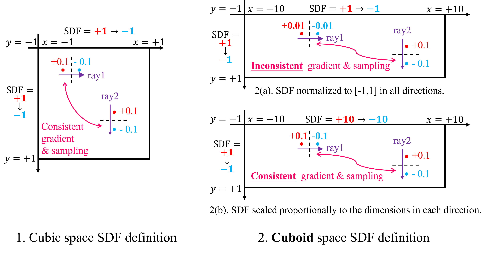
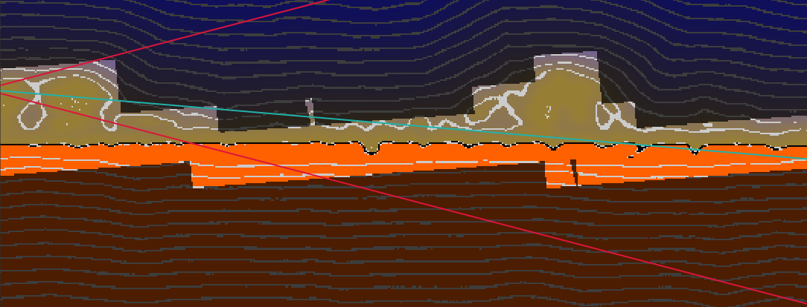
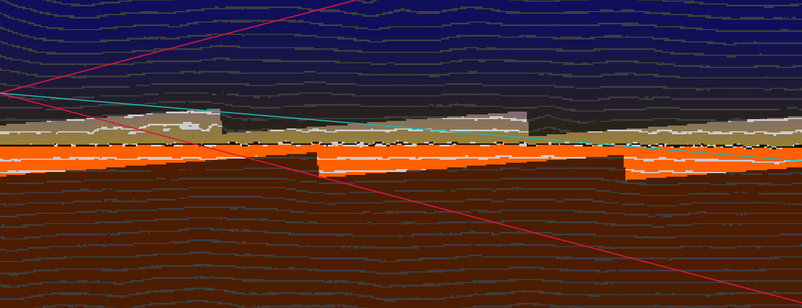
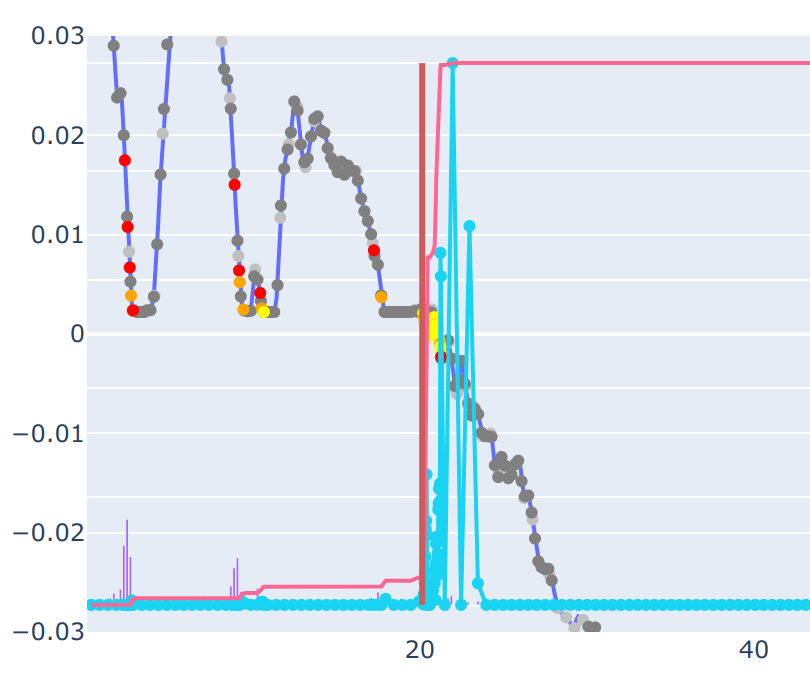
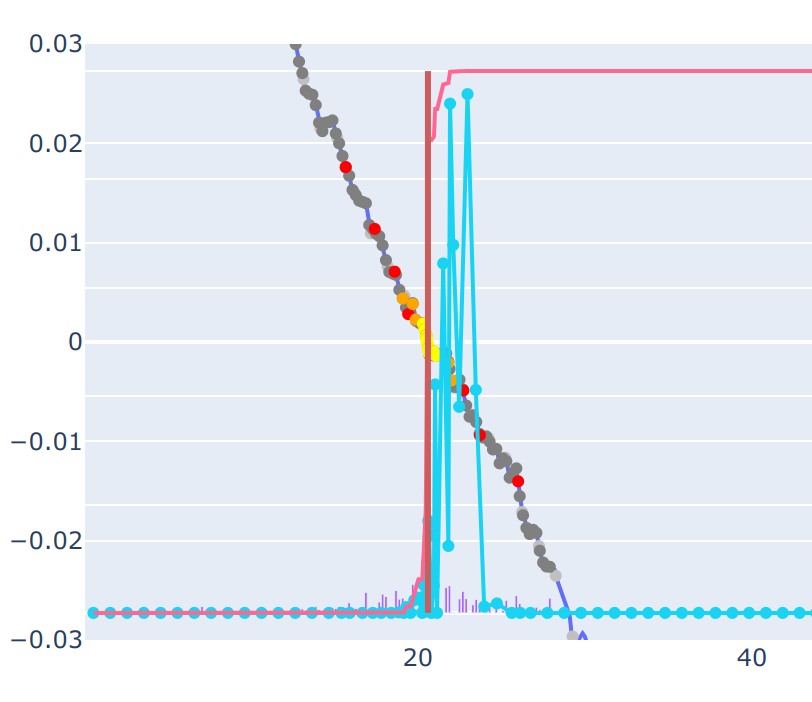
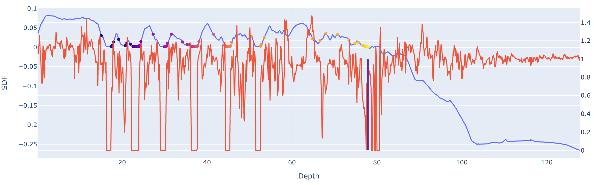

# [neuralsim] StreetSurf

[website](https://ventusff.github.io/streetsurf_web/) | [arxiv](https://arxiv.org/abs/2306.04988) | [PDF](https://arxiv.org/pdf/2306.04988)

:rocket: Official implementation :rocket:

The official implementation of "StreetSurf: Extending Multi-view Implicit Surface Reconstruction to Street Views".

```bibtex
@article{guo2023streetsurf,
    title={StreetSurf: Extending Multi-view Implicit Surface Reconstruction to Street Views},
    author={Guo, Jianfei and Deng, Nianchen and Li, Xinyang and Bai, Yeqi and Shi, Botian and Wang, Chiyu and Ding, Chenjing and Wang, Dongliang and Li, Yikang},
    journal={arXiv preprint arXiv:2306.04988},
    year={2023}
}
```

## Usage

### Requirements

- <=2 hrs training time on single RTX3090

- ~16 GiB GPU Mem
- \>24 GiB CPU Mem (Caching data to speed up)

### Dataset preparation

- Waymo Open Dataset - Perception
  - [Full readme](../../dataio/autonomous_driving/waymo/README.md)
  - Split file: [waymo_static_32.lst](../../dataio/autonomous_driving/waymo/waymo_static_32.lst)
  - [Quick download](https://drive.google.com/file/d/13kmc01KWUINgF5zHONJCYO7OPaWnLbrG/view?usp=sharing) of one sequence(seg100613)'s processed data and extracted priors
    - (Make sure you fill in the ToS of Waymo Open Dataset!)

### Major settings

> NOTE: To use pretrained models for evaluation, you need to specify your local dataset path with `--dataset_cfg.param.root=/path/to/waymo/processed`. Otherwise if you don't want to load GT data, you need to specify `--no_gt` when running `render.py`.

| Settings                                                     | Config file & Pretrained models                              | Camera images                        | Sky mask               | LiDAR ranges                | Monocular normals      | Monocular depths       |
| ------------------------------------------------------------ | ------------------------------------------------------------ | ------------------------------------ | ---------------------- | --------------------------- | ---------------------- | ---------------------- |
| Multi-view reconstruction with LiDAR                         | [withmask_withlidar.230814.yaml](../../code_single/configs/waymo/streetsurf/withmask_withlidar.230814.yaml)<br/>Pretrained: [[baidu:`h6he`]](https://pan.baidu.com/s/1VwFdapaoK1wVZLPqN5zsXA)\|[[google]](https://drive.google.com/file/d/13OOE452fGd3-GruI0rvRRPXjXnKG1L2k/view?usp=sharing)  | :white_check_mark: 3 frontal cameras | :white_check_mark: Yes | :white_check_mark: 5 LiDARs |                        |                        |
| Multi-view reconstruction with LiDAR<br />(:star: <u>smoother surfaces</u>) | [withmask_withlidar_withnormal.230814.yaml](../../code_single/configs/waymo/streetsurf/withmask_withlidar_withnormal.230814.yaml) | :white_check_mark: 3 frontal cameras | :white_check_mark: Yes | :white_check_mark: 5 LiDARs | :white_check_mark: Yes |                        |
| Multi-view reconstruction with LiDAR<br />(<u>no mask</u>)   | [nomask_withlidar.230814.yaml](../../code_single/configs/waymo/streetsurf/nomask_withlidar.230814.yaml) | :white_check_mark: 3 frontal cameras |                        | :white_check_mark: 5 LiDARs |                        |                        |
| Multi-view reconstruction <u>without LiDAR</u><br />(i.e. multi-view posed images + inferred cues) | [withmask_nolidar.230814.yaml](../../code_single/configs/waymo/streetsurf/withmask_nolidar.230814.yaml) | :white_check_mark: 3 frontal cameras | :white_check_mark: Yes |                             | :white_check_mark: Yes | :white_check_mark: Yes |
| <u>LiDAR only</u> reconstruction<br />(i.e. from LiDAR ranges to surfaces) | [lidaronly_filterobj.230814.yaml](../../code_single/configs/waymo/streetsurf/lidaronly_filterobj.230814.yaml) <br />:pushpin: NOTE: Applicable to all 798 training sequences in Waymo Open Dataset - Perception split |                                      |                        | :white_check_mark: 5 LiDARs |                        |                        |

## Instructions

- [Training](#training)
  - [\> Start a fresh new training](#-start-a-fresh-new-training)
  - [\> Resume a previous experiment](#-resume-a-previous-experiment)
  - [\> Rich training logs](#-rich-training-logs)
  - [\> Debug training errors](#-debug-training-errors)
- [Rendering](#rendering)
  - [\> Replay](#-replay)
  - [\> NVS](#-nvs)
  - [\> With mesh visualization](#-with-mesh-visualization)
- [Appearance evaluation](#appearance-evaluation)
- [LiDAR simulation](#lidar-simulation)
  - [\> Simulate a single LiDAR](#-simulate-a-single-lidar)
  - [\> Simulate a demo of a list of LiDAR models](#-simulate-a-demo-of-a-list-of-lidar-models)

- [LiDAR evaluation](#lidar-evaluation)
- [Mesh extraction](#mesh-extraction)
- [Occupancy grid extraction](#occupancy-grid-extraction)
  - [\> Format of the extracted occupancy grid](#-format-of-the-extracted-occupancy-grid)

NOTE:

- :running: You can combine multiple subtasks listed below and automatically execute them one by one with [run.py](tools/run.py) . For example:

  - ```shell
    python code_single/tools/run.py train,eval,eval_lidar,extract_mesh \
    --config code_single/configs/xxx.yaml \
    --eval.downscale=2 --eval_lidar.lidar_id=lidar_TOP \
    --extract_mesh.to_world --extract_mesh.res=0.1
    ```

  - `--config` or `--resume_dir` are common args shared across all subtasks.

- :pushpin: All the instructions below assume you have already `cd` into `/path/to/neuralsim` .

### Training

#### > Start a fresh new training

```shell
python code_single/tools/train.py --config code_single/configs/xxx.yaml
```

:gear: You can specify temporary configs via command line args like `--aaa.bbb=ccc`, which will temporarily modify the `aaa:bbb` field in `xxx.yaml` in this run. For more details on how the command line and yaml configuration work, please refer to [this doc](https://github.com/PJLab-ADG/nr3d_lib/blob/main/docs/config.md) .

#### > Resume a previous experiment

```shell
python code_single/tools/train.py --resume_dir logs/streetsurf/seg100613
```

You can also resume a experiment if everything is not changed in the original config yaml by directly specifying `--config code_single/configs/xxx.yaml` . 

#### > Rich training logs

We provide rich logging information with tensorboard. 

Check them out by

```shell
tensorboard --logdir logs/streetsurf/seg100613
```

The logging frequency of scalars is controlled by `--training.i_log` field. (how many iterations per log entry).

The logging frequency of images (visualization or renderings) is controlled by `--training.i_val` field.

#### > Debug training errors

We also provide a primitive debugging tool for checking gradients. You can try it out by modifying `self.debug_grad=True` in the `Trainer` class. Note that this will significantly slow down training and should be used along with `debugpy` or other tools.

### Rendering

- Usually, ignoring `num_coarse` samples will not significantly affect the results and will speed up rendering. To achieve this, additionally specify `--assetbank_cfg.Street.model_params.ray_query_cfg.query_param.num_coarse=0`

- To save time for rendering and evaluation, it is recommended to render downscaled videos. In our [StreetSurf](https://ventusff.github.io/streetsurf_web/) paper, all the reported results of our method and all the baseline methods are evaluated with `--downscale=2`

#### > Replay

By default, [tools/render.py](tools/render.py) runs in replay mode, which will render frames between the optionally given `--start_frame` and `--stop_frame` parameter with everything untouched.

```shell
python code_single/tools/render.py --resume_dir logs/streetsurf/seg100613 \
--downscale=2 \
--assetbank_cfg.Street.model_params.ray_query_cfg.query_param.num_coarse=0
```

#### > NVS

NOTE: `--start_frame` and `--stop_frame` in this case specifies the reference frames for the camera path creation method. The real length of the NVS path is specified by `--nvs_num_frames`.

```shell
python code_single/tools/render.py --resume_dir logs/streetsurf/seg100613 \
--nvs_path=street_view --nvs_node_id=ego_car --nvs_param=2.0,1.0,3.0,0.0,2.0,-2.0 \
--nvs_num_frames=120 --start_frame=80 --stop_frame=160 --downscale=4 \
--assetbank_cfg.Street.model_params.ray_query_cfg.query_param.num_coarse=0
```

#### > With mesh visualization

<details>
<summary>An example (click to expand)</summary>


</details>

To visualize a specific mesh from the perspective of the original cameras when rendering, additionally specify `--render_mesh=xxx.ply` :

```shell
python code_single/tools/render.py --resume_dir logs/streetsurf/seg100613 \
--downscale=4 --render_mesh /path/to/logs/xxx/meshes/xxx.ply \
--render_mesh_transform=identity \
--assetbank_cfg.Street.model_params.ray_query_cfg.query_param.num_coarse=0
```

NOTE: If the input mesh is already in world coordinates (e.g. `--to_world` is specified when extracting mesh), `--render_mesh_transform` should just be `identity`. If the input mesh is in object coordinates, `--render_mesh_transform` should be `to_world`.

### Appearance Evaluation

This is similar to the replay mode in [tools/render.py](tools/render.py), but with additional calculations and limitations for evaluation.

NOTE: In our [StreetSurf](https://ventusff.github.io/streetsurf_web/) paper, all the reported results of our method and all the baseline methods are evaluated with `--downscale=2`

```shell
python code_single/tools/eval.py --resume_dir logs/streetsurf/seg100613 \
--downscale=2
```

### LiDAR simulation

As mentioned in Section 5.1 of the StreetSurf paper, to narrow the length of the responsive ray interval in volumetric rendering and approaches closer to the behavior of surface rendering, a larger `forward_inv_s` value can be manually assigned during LiDAR rendering. If left unspecified, the learned `forward_inv_s` from the network will be used instead, which is usually much smaller (e.g., 2000.0) and can result in ambiguous renderings at the edges of objects with dramatic depth changes.

#### > Simulate a single LiDAR

For example, to simulate the original LiDAR model:

```shell
python code_single/toos/render.py --resume_dir logs/streetsurf/seg100613 \
--no_cam --render_lidar --lidar_model=original_reren --lidar_id=lidar_TOP \
--lidar_forward_inv_s=64000.0
```

A visualization window can be popped up by additionally specifying `--lidar_vis_verbose`.

You can also try this out when rendering in NVS mode.

#### > Simulate a demo of a list of LiDAR models

In addition to the original LiDAR, numerous other real-world LiDAR models can be simulated.

:arrow_right: Below is a script that sequentially simulates a list of LiDAR models:

```shell
bash code_single/tools/demo_lidar_sim.sh logs/streetsurf/seg100613 \
--lidar_vis_width=1200
```

:arrow_right: A visualization window can be popped up by additionally specifying `--lidar_vis_verbose`.

### LiDAR evaluation

```shell
python code_single/tools/eval_lidar.py --resume_dir logs/streetsurf/seg100613 \
--lidar_id=lidar_TOP --dirname=eval_lidar_TOP --forward_inv_s=64000.0
```

:arrow_right: A visualization video like the one in [StreetSurf website](https://ventusff.github.io/streetsurf_web/) can be produced by additionally specifying `--video_backend=vedo`:

```shell
python code_single/tools/eval_lidar.py --resume_dir logs/streetsurf/seg100613 \
--lidar_id=lidar_TOP --dirname=eval_lidar_TOP --forward_inv_s=64000.0 \
--video_backend=vedo
```

:arrow_right: A visualization window can be popped up by additionally specifying `--video_verbose`.

### Mesh extraction

:arrow_right: To extract mesh of a specific experiment:

```shell
python code_single/tools/extract_mesh.py --resume_dir logs/streetsurf/seg100613 \
--to_world --res=0.1
```

:arrow_right: To extract mesh with color, simply add `--include_color`:

```shell
python code_single/tools/extract_mesh.py --resume_dir logs/streetsurf/seg100613 \
--to_world --res=0.1 --include_color
```

### Occupancy grid extraction

```shell
python code_single/tools/extract_occgrid.py --resume_dir logs/streetsurf/seg100613 \
--occ_res=0.1
```

A visualization window can be popped up when the extraction is finished by additionally specifying `--verbose` (:warning: Might run out of CPU mem if `occ_res` is small and the resulting resolution is large).

#### > Format of the extracted occupancy grid

We opt to store the actual occupied integer coordinates rather than a full-resolution 3D boolean grid to save space.

The output file is in `.npz` format, containing occupied vertex coordinates and meta information.

Below is a description and example of how to read the file:

```python
import numpy as np
datadict = np.load("xxx.npz", allow_pickle=True)
datadict['occ_corners'] # [N, 3], int16, integer coordinates of the actual occupied grid points, where N represents the number of actual occupied grids
datadict['sidelength'] # [res_x, res_y, res_z], int, integer side lengths allocated in x, y, z directions respectively
datadict['occ_res'] # float, default 0.1, resolution setting when extracting occupied grid, i.e., the side length of each cubic grid
datadict['coord_min'] # [3,], float, world coordinates corresponding to the vertex at the front-left-bottom corner (the vertex with smaller values in x, y, z directions) of the integer coordinate [0,0,0] grid
datadict['coord_offset'] # [3,], float, offset between the world coordinate system definition and the world coordinate system definition of the original data sequence (original_world=current_world+coord_offset)
datadict['meta'] # dict, a dictionary containing the meta information of the scene
datadict['meta']['scene_id'] # str, full name id of the current sequence "segment-xxxxx-with_camera_labels"
datadict['meta']['start_frame'] # int, the start frame defined during the training of the current sequence
datadict['meta']['num_frames'] # int, the total number of frames defined during the training of the current sequence (end frame = start frame + total number of frames)

# To read:
voxel_coords_in_world = datadict['occ_corners'].astype(float) * datadict['occ_res'] + datadict['coord_min']
voxel_coords_in_data_world = voxel_coords_in_world + datadict['coord_offset']
```

## Implementation Notes

### Disentanglement of close-range and distant-view

These parts are introduced in our [StreetSurf](https://ventusff.github.io/streetsurf_web/) paper section 3.3.1.

### Multi-stage upsampling on occupancy grid

This part is introduced in our [StreetSurf](https://ventusff.github.io/streetsurf_web/) paper section 4.1 and Fig. 7. The core implementation is contained [here](https://github.com/PJLab-ADG/nr3d_lib/blob/main/models/fields/neus/renderer_mixin.py), in `_ray_query_march_occ_multi_upsample_compressed`. Most of the logics are implemented with the [pack_ops](https://github.com/PJLab-ADG/nr3d_lib#pack_ops) toolkit in [nr3d_lib](https://github.com/PJLab-ADG/nr3d_lib).

### Training steps

In order to utilize various types of supervision, we have defined three different training steps based on the type of dataloader:

- `train_step_pixel` 
  - Loads `PixelDataset` / `JointFramePixelDataset` and samples unorganized pixels.
    - `JointFramePixelDataset` samples both frame indices and pixel positions simultaneously, similar to the implementation of [Instant-NGP](https://github.com/NVlabs/instant-ngp). Each sampled pixel comes from different frames and pixel positions.
    - `PixelDataset` first samples the frame indice, then samples a set of pixels within this single frame.
  - Mainly for photometric reconstruction loss. Monocular normals supervision can also be applied here.
- `train_step_lidar`
  - Loads `LidarDataset` and samples unorganized LiDAR beams.
    - It can sample beams from a single LiDAR or simultaneously from multiple LiDARs, controlled by `lidar_sample_mode`. For more details, please refer to  [dataio/dataloader.py](dataio/dataloader.py) :: `LidarDataset`.
  - Mainly for LiDAR sparse depth loss.
- `train_step_image_patch`
  - Loads `ImagePatchDataset` and samples down-sampled image patches, which are organized patch pixels compared to `train_step_pixel` .
  - One major application is that mono depth loss requires regular image patches to estimate the scale and shift of the inferred monocular depths. 
  - Also applicable for other losses that require regular images, such as perceptual loss, GAN loss, etc.

### SDF definition and stable learning

#### > SDF scale definition for real-world cuboid spaces

How to define the scale of SDF in a real-world cuboid space?



As depicted in the above figure Fig.1, for cubic space or other spaces with an equal aspect ratio such as spherical spaces, we can naturally define and normalize the scale of the SDF to match the space of [-1,1]^3. 

However, as shown in Fig.2(a), directly defining a normalized SDF for cuboid space would lead to instability in the convergence of the eikonal loss and throughout the training process, while also causing significant inconsistency in sampling granularity across different directions. 

The instability is due to the varying scale of SDF changes for the same sampling length segment in different directions, which implies a substantial discrepancy in the magnitude of gradient components for the reconstruction loss back-propagation from different directions.

Hence, as illustrated in Fig.2(b), we ensure that the scale of SDF changes is the same across all three spatial dimensions when defining the SDF. 

This primarily affects two parts in the code implementation:

- One is in [nr3d_lib/models/fields/sdf/utils.py](https://github.com/PJLab-ADG/nr3d_lib/blob/main/models/fields/sdf/utils.py) :: `pretrain_xxx` functions,  where the pseudo GT value is defined during SDF initialization. 
- The other is in [nr3d_lib/models/fields/sdf/lotd_sdf.py](https://github.com/PJLab-ADG/nr3d_lib/blob/main/models/fields/sdf/lotd_sdf.py) :: `forward_sdf_nablas`, where the calculated nablas vectors are in the object system space, rather than the normalized [-1,1]^3 network space.

:pushpin: In StreetSurf, we manually set a **universal** SDF scale for all data sequences, given that the ego car's distance relation remains consistent across all sequences, regardless of their length and size variations. This value is controlled by `surface_cfg.sdf_scale`. We opt for `sdf_scale=25` for Waymo Open Dataset, signifying that a single unit of SDF change corresponds to a 25-unit (meters) change in real-world length.

#### > Stabilizing analytic eikonal loss

1. **Additionally apply Eikonal loss on occupied region & on points marched from the ray query process**

|              | Without additional eikonal loss applied in occupied region   | With additional eikonal loss applied in occupied region      |
| ------------ | ------------------------------------------------------------ | ------------------------------------------------------------ |
| SDF slice    |  |  |
| Ray marching | <br />Blue line: SDF curve; pink line: cumulated weights |  |

2. **Using `Softplus(beta=100.0)` for SDF decoder instead of ReLU**

As shown in the figure below, when using `ReLU` as the activation function in the SDF decoder, nablas in certain regions can become irreversibly stuck at zero, with no gradient available to drive change. 

This situation arises during training when the `ReLU` in the final hidden layer of the decoder becomes entirely inactive for specific input positions, causing the network's output to be directly equivalent to its `bias`.




Following previous practice of IDR, NeuS etc., we use `Softplus(beta=100.0)` instead of `ReLU` for the activation of the SDF's decoder.

3. **Adjust Adam momentum configs**

Set Adam Optimizer with `betas=(0.9,0.99), eps=1.0e-15` instead of the default settings `betas=(0.9,0.999), eps=1.0e-8`.

- Smaller `beta2` values (smaller exponential decay rate for the second moment estimates) significantly stabilize the convergence of the Eikonal loss.

- As stated in Instant-NGP, smaller `eps` values helps when grid gradients are sparse and weak. 

4. **Pre-training with decoder zero-out**

Controlled by `surface_cfg.geo_init_method=pretrain_after_zero_out` in the config yaml.

5. **Gradually releasing higher resolutions when training**

Controlled by `surface_cfg.encoding_cfg.anneal_cfg` in the config yaml. 

### How to use monocular priors

Code: [app/loss/mono.py](../../app/loss/mono.py)

Generally speaking, when it comes to NeuS training, monocular normal supervision plays a much more important role than the monocular depth supervision. Under the settings of training without LiDAR, for some sequences it is OK to just use monocular normals supervision.

The monocular normals supervision is implemented with `MonoNormalLoss`.  

- Monocular normals supervision can be applied in both `train_step_pixel` and `train_step_image_patch`, while monocular depth supervision is only suitable in `train_step_image_patch`, as it requires regular image patches to estimate the scale and shift of the inferred monocular depths. Using unorganized pixels typically fails to produce reasonable estimation of scales and shifts.

The monocular depths supervision is implemented with `MonoSSIDepthLoss`, which is modified from the original [MonoSDF](https://github.com/autonomousvision/monosdf) implementation.

- For street views, the estimation of monocular depths on distant views and the sky is extremely unreliable, thus it should be masked out when estimating scales and shifts (controlled by `ignore_mask_list`). 
  - However, we can only rely on the predicted (volume-rendered) close-range mask to accomplish this, as there are no other straightforward methods to infer which areas are close-range and which are distant views. The volume-rendered masks are often excessively expanded by several pixels, therefore mask erosion is required before use (controlled by `mask_erode`). 
- Both of the volume-rendered depths and volume-rendered masks are unreliable in the beginning of training. Hence, monocular depths supervision is only enabled after a certain number of iterations (controlled by `enable_after`).
- The difference (image gradient) regularization (controlled by `alpha_grad_reg`) of the monocular depth loss is more significant than the depth regression loss itself. It considerably reduces and mitigates the phenomenon of surface discontinuity when solely using monocular normals supervision.

### How to use LiDAR signal

:arrow_right: Code: [dataio/autonomous_driving/waymo/preprocess.py)](../../dataio/autonomous_driving/waymo/preprocess.py) (the lines after `if laser.name == dataset_pb2.LaserName.TOP:`)

- Taking into account the scanning time of LiDAR beams and the motion of the ego car 
  - Primarily, utilizing the per-LiDAR ego car pose annotations provided by Waymo

:arrow_right: Code: [app/loss/lidar.py](../../app/loss/lidar.py)

- Change to L1 loss for better geometric accuracy
- Discard LiDAR outliers by filtering based on a multiple of the median of the L1 errors.
- Line of sight regularization
